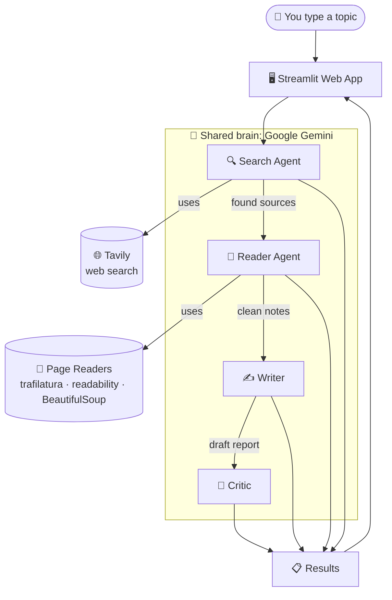

# 🔍 LangChain Multi-Agent Research System

Give it a topic, and a little team of AI "workers" researches it for you and hands back a
tidy, written report — plus an honest critique of that report. Think of it as a **tiny
research department that runs itself**.

There's a clean web app (built with Streamlit) where you type a question, press Enter, and
watch each worker do its job in real time.

---

## 🧠 The idea, in plain English

Instead of asking one AI to do everything at once, the work is split between **four
specialists**, each doing the one thing it's good at — like a relay race where every runner
passes the baton to the next:

| # | Worker | What it does |
|---|--------|--------------|
| 1 | **Search Agent** 🔍 | Googles the topic and gathers recent, reliable sources |
| 2 | **Reader Agent** 📖 | Opens the best source and reads it deeply for real detail |
| 3 | **Writer** ✍️ | Turns all those notes into a clear, structured report |
| 4 | **Critic** 🧐 | Grades the report out of 10 and says what could be better |

The result: a report that's more thorough and more honest than a single quick answer.

---

## ✨ What you get

- A **web app** with a topic box, one-click example topics, and live progress cards that
  light up **WAITING → RUNNING → DONE** as each worker finishes.
- The finished **report**, the **critic's review**, and the **raw research notes**, neatly
  split into tabs.
- A **Download** button to save the report as a file.

---

## 🛠️ What's under the hood (just so you know)

- **LangChain + LangGraph** — the framework that lets the agents use tools and pass work along.
- **Google Gemini** — the AI brain shared by all the workers.
- **Tavily** — the web-search tool the Search Agent uses.
- **trafilatura / readability / BeautifulSoup** — the tools the Reader uses to pull clean
  text out of messy web pages.
- **Streamlit** — the web app front-end.

You don't need to understand any of these to use it — they're just the parts inside the box.

---

---

## 🏗️ High-level architecture

Here's the whole journey — from your question to the finished report:



**Reading the diagram:**

1. **You** type a topic into the **web app**.
2. The **Search Agent** asks Tavily to find good sources on the web.
3. The **Reader Agent** opens the best source and uses its page-reading tools to pull out
   the clean, useful text.
4. The **Writer** takes all those notes and drafts a structured report.
5. The **Critic** reads that report and grades it.
6. Everything flows back to the **web app**, where you see the report, the critique, and the
   raw notes.

The four workers all share **one brain** (Google Gemini) — they just each get a different
job and different tools. The work moves in a straight line, one step feeding the next, like
an assembly line.

---

## 🚀 Getting started

**1. Create the environment**

```bash
conda create -n langchainmultiagent python=3.11 -y
conda activate langchainmultiagent
pip install -r deployment/requirements.txt
```

**2. Add your keys**

Create a file called .env in the project's main folder with two keys:

GOOGLE_API_KEY=your_google_key_here
TAVILY_API_KEY=your_tavily_key_here
Get a Google key at https://aistudio.google.com/app/apikey (copy the whole thing).
Get a Tavily key at https://tavily.com.

**3. Run it**

For the web app (the nice one):

```bash
streamlit run deployment/app.py
```

Or, to run it in the terminal without the web page:

```bash
python -m deployment.main
```
>💡 Always run from the main project folder, not from inside deployment/.

📁 Project layout
deployment/
├── app.py                 # the Streamlit web app
├── main.py                # run it from the terminal
├── agents/agents.py       # defines the four workers
├── pipeline/pipeline.py   # runs the four workers in order
└── tools/tools.py         # web search + page-reading tools